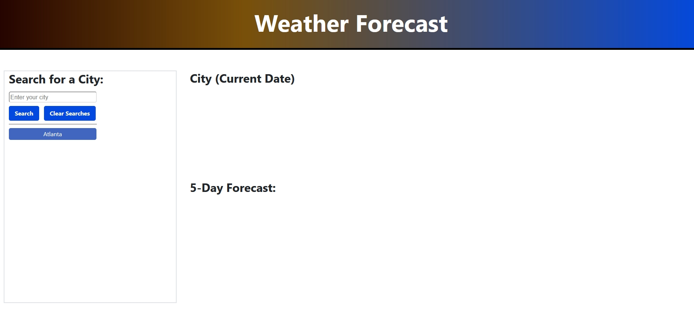

# Weather-Forecast-Dashboard
A page that will display a 5-day weather forecast of various cities that the user can search for, built with 3rd-party APIs such OpenWeather, Bootstrap, jQuery, jQueryUI, dayJS.

The launched page can be found [here](https://nganpham89.github.io/Weather-Forecast-Dashboard/)

## Screenshots

## Features of this weather app

- A search box with auto complete suggestion to various major cities in the U.S.
- A display of the searched city's date, temperature, windspeed, and humidity.
- A display of the searched city's weather prediction informations for the next 5 days.
- A log of previous searches that the user has made, which they can click on to perform another query.
- Said log would also be stored, even when the user refresh the page. A clear button is also provided to clear said log. 

## Goals of this project

- [x] Learning about how to retrieve data from a 3rd-party API and using those datas to serve the user dynamically.
- [x] Learning about passing retrieve data through various functions, via async and await javascript capability.
- [x] Experimenting with features provided by Bootstrap and jQueryUI.
- [x] More "for" loops.